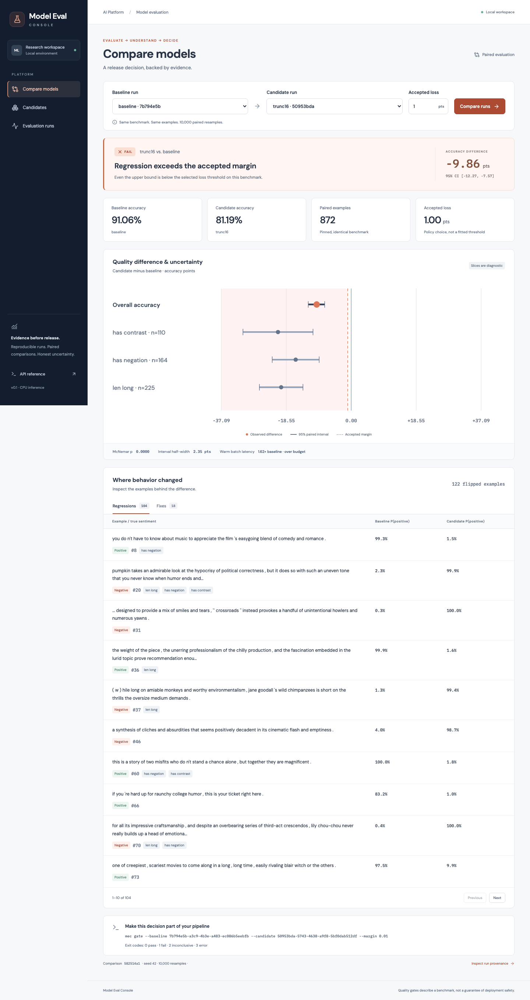
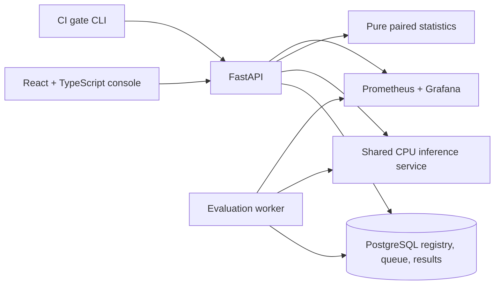

# Model Eval Console

**A release decision, backed by evidence.**

A full-stack developer platform for evaluating binary sentiment models. Register a pinned Hugging Face checkpoint and serving configuration, evaluate a content-hashed benchmark, and investigate a **PASS**, **FAIL**, or **INCONCLUSIVE** quality gate through a React console or CI command.

Python · FastAPI · PyTorch · Hugging Face · React · TypeScript · PostgreSQL · Docker · Prometheus · Grafana

## Classifier versus small LLM

The console also evaluates **Qwen3-0.6B** with frozen zero-shot and few-shot sentiment prompts against DistilBERT on a deterministic **400-review balanced IMDb test sample**. It records prompt hashes, greedy generation settings, raw answers and invalid outputs. Invalid answers count as incorrect; generative outputs are never assigned fabricated probabilities.

Run the extended experiment after starting Compose:

```sh
docker compose exec -T api python /app/scripts/seed_llm_demo.py --api-url http://api:8000 --output /tmp/llm-results.json
```

Allow at least 6 GB for the Docker VM and extra CPU evaluation time. [The frozen protocol and demo guide](docs/llm-experiment.md) explains sampling, prompt versions, different tokenizer exposure, timing and interpretation.

The completed native FP32 experiment scored **81.75% for DistilBERT and 50% for both Qwen prompt configurations**. Both Qwen configurations returned negative for every review and failed the gate, with a −31.75-point difference and a paired interval of [−37.75, −25.75] points. This is evidence about the frozen prompts and decoding settings, not a general judgment of Qwen. [The full measured snapshot](docs/results/llm-native-cpu.json) includes all 1,200 predictions, raw generated answers, configurations and diagnostic controls. The container BF16 attempts were stopped after a performance check; they are not completed benchmark evidence.

[View the measured LLM comparison](docs/screenshots/llm-compare.png).

## The real experiment

Can dynamic int8 quantization replace an FP32 sentiment model without losing more than one accuracy point? Does a serving configuration that truncates inputs to 16 tokens introduce a regression?

Measured on all **872 SST-2 validation examples**, with the same pinned DistilBERT weights:

| Candidate | Accuracy | Difference from baseline | 95% paired interval, points | Gate |
|---|---:|---:|---:|---|
| Baseline, 128 tokens, batch 8 | 91.06% | — | — | Reference |
| Batch 32 | 91.06% | 0.00 pts | [0.00, 0.00] | PASS |
| Dynamic int8 | 90.25% | −0.80 pts | [−1.95, +0.34] | INCONCLUSIVE |
| Truncate to 16 tokens | 81.19% | −9.86 pts | [−12.27, −7.57] | FAIL |

The int8 checkpoint's serialized weights were **48.2% smaller**, but its warm batch p95 was **5.71× slower** in this local macOS/ARM64 qnnpack measurement. The console reports the quality and latency decisions separately. There is no assumed efficiency win.

The truncation candidate caused **104 regressions and 18 fixes**. The long-input slice lost **20 accuracy points**. These are actual model outputs, not fabricated demo scores. Full configuration, environment, timing methodology, and results are in [the measured snapshot](docs/results/local-cpu.json). Results on other hardware can differ.

A second run from a fresh Docker cache also completed all four evaluations: [container measurements](docs/results/compose-cpu.json). Its quality verdicts are the same; int8 accuracy is 90.48% and its warm latency is 1.51× baseline. The truncation candidate is faster there but still fails quality. Keep each environment's measurements together.



## Run the real demo

Prerequisites: Docker with Compose, approximately 4 GB available memory, and internet access for the first model/dataset download. No API key or GPU is required. Run from the repository root:

```sh
docker compose up --build -d --wait
docker compose exec -T api python /app/scripts/seed_demo.py --api-url http://api:8000 --output /tmp/demo-results.json
```

Open **http://localhost:5173**. API docs are at **http://localhost:8000/docs**, Grafana at **http://localhost:3000**, and Prometheus at **http://localhost:9090**. The seed prints a direct comparison link and stores measured results inside the API container. To save them locally:

```sh
docker compose cp api:/tmp/demo-results.json ./demo-results.json
```

First startup downloads about 250 MB of model weights plus dependencies. The benchmark takes a few minutes on a laptop CPU. Subsequent runs reuse the Hugging Face cache. The seed can be rerun: registry/dataset records are reused after verifying their pinned identities, and fresh runs are created.

Use `docker-compose` in place of `docker compose` if your installation provides the standalone executable. Containers and named volumes belong to this project. `docker compose down` stops the app while preserving data.

## Try the workflow

1. **Candidates:** inspect the pinned model revision, max tokens, quantization, and batch size; register a new immutable configuration.
2. **Evaluation runs:** start a run, watch persisted prediction progress, inspect errors/retries, and filter individual predictions.
3. **Compare models:** choose two completed runs on the same benchmark. Inspect the interval against the accepted loss, diagnostic slices, regressions, fixes, and both probabilities.
4. **Pipeline:** use the exact run IDs shown below the comparison in `mec gate`.
5. **Operations:** inspect queue depth, attempt outcomes, inference latency, and lease recovery in Grafana.

The UI supports keyboard interaction, text-based verdicts, reduced motion, mobile layouts, accessible chart descriptions, and keyboard tab navigation. Browser tests include automated WCAG checks.

## CI quality gate

```sh
docker compose exec -T api mec gate \
  --api-url http://api:8000 \
  --baseline <baseline-run-uuid> --candidate <candidate-run-uuid> --margin 0.01
```

| Exit | Meaning |
|---:|---|
| 0 | Passes this benchmark's quality gate at the selected margin |
| 1 | Regression exceeds the selected margin |
| 2 | Inconclusive; pipeline policy must explicitly block or warn |
| 3 | API, validation, or transport error |

Only accuracy changes the quality verdict. Slice results are diagnostic, and the warm batch latency budget is separate. A PASS is not a guarantee of deployment safety.

## Architecture and reliability



The API enqueues evaluations; it never performs a benchmark inside an HTTP request. Workers claim jobs with `FOR UPDATE SKIP LOCKED`, renew leases, and persist batches transactionally. A claim token fences every heartbeat, prediction write, and completion, so a paused worker cannot overwrite a replacement worker's work. Recovery is at-least-once computation with unique per-example persistence; it is not exactly-once execution.

Completion requires the **exact expected example IDs**, not just a count. Resumes refuse mixed evaluator code/environment. Registry records and benchmark examples reject updates at the database level. Dataset config, split, revision, ordered content hash, evaluator version, library versions, CPU thread count, and quantization engine are recorded.

## Structure

```text
backend/app/
  api/           Routers, request/response schemas, problem details
  core/          Settings, structured logging, Prometheus metrics
  db/            Typed SQLAlchemy models and session management
  inference/     Shared inference, bounded model cache, warm latency benchmark
  services/      Dataset ingestion and persisted comparisons
  stats/         Pure bootstrap, McNemar, and margin-based gate
  worker/        Claims, ownership fencing, evaluation, lease heartbeats
  cli/           Pipeline command and exit-code contract
backend/migrations/  Reviewed Alembic schema and immutability triggers
backend/tests/       Unit, property, coverage, API, concurrency, process-kill tests
frontend/src/
  api/           Generated OpenAPI types and typed fetch client
  components/    Shared states, interval chart, verdicts, flipped examples
  pages/         Registry, comparison, run history and detail
frontend/e2e/        Browser workflows, keyboard and accessibility checks
ops/                 Provisioned Prometheus and Grafana configuration
scripts/             Pinned real demo, separate synthetic fixtures, contract export
docs/                Design, statistical assumptions, limitations, review evidence
```

## Develop and verify

Python 3.12 and Node 22.13+ are supported. Python dependencies are locked with uv; frontend dependencies are locked with npm. Linux uses CPU-only PyTorch wheels.

```sh
docker compose up -d db
cd backend
uv sync --frozen --extra dev --python 3.12
uv run alembic upgrade head
uv run uvicorn app.main:app --reload
```

In another terminal, run `cd backend && uv run mec-worker`; in a third run `cd frontend && npm ci && npm run dev`. The Vite proxy connects to the local API, and migrations run explicitly. Settings are listed in [.env.example](.env.example).

Backend verification, from `backend/`:

```sh
uv run ruff check app tests migrations ../scripts
uv run ruff format --check app tests migrations ../scripts
uv run mypy app
uv run pytest
uv run alembic check
```

Tests use an isolated PostgreSQL schema in a disposable Testcontainers database. Set `MEC_TEST_DATABASE_URL` to an existing disposable/local database if desired; the test suite never truncates the demo schema. For Colima, set `DOCKER_HOST=unix://$HOME/.colima/default/docker.sock` and `TESTCONTAINERS_DOCKER_SOCKET_OVERRIDE=/var/run/docker.sock`.

Frontend verification, from `frontend/`:

```sh
npm ci
npm run lint
npm run format:check
npm run build
npm test
npx playwright install chromium
npm run e2e
```

Browser tests require an API/UI with a completed FAIL comparison. CI seeds **explicitly labeled synthetic predictions**, exercises the same comparison API and CLI, and runs the browser suite against Compose. To seed fixtures in a fresh local test deployment:

```sh
docker compose exec -T api python /app/scripts/seed_fixtures.py --output /tmp/fixtures.json
docker compose exec -T api python /app/scripts/check_gate.py --fixtures /tmp/fixtures.json
```

Fixture candidates are not real checkpoints. They exist to test UI/CLI behavior without a network download or a stochastic model score. Never use fixture results as ML evidence.

To regenerate the contract, run `backend/.venv/bin/python scripts/export_openapi.py` from the root and `npm run generate` from `frontend/`. CI detects changes to the committed OpenAPI spec and generated TypeScript types.

## Read next

- [Design and engineering decisions](docs/design.md)
- [Statistics, coverage validation, and interpretation](docs/stats.md)
- [Scope and limitations](docs/limitations.md)
- [Five-minute demo and interview discussion](docs/demo.md)
- [Small LLM versus classifier experiment](docs/llm-experiment.md)
- [Independent reviews and local validation](docs/validation.md)

This project demonstrates a small, reliable developer platform and explicit evaluation decisions. It does not claim production traffic, Apple-scale operation, GPU serving, or general-purpose LLM/agent evaluation.
